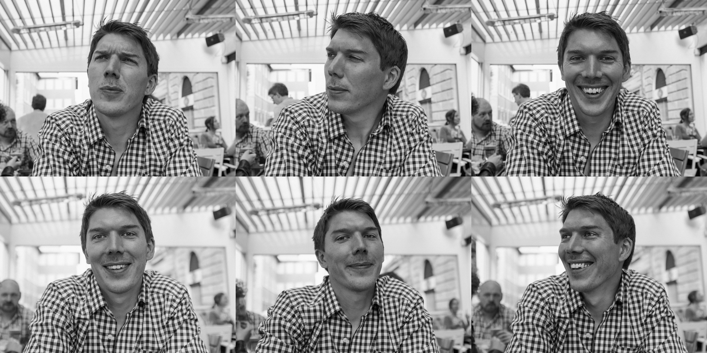

---

title: About
summary: About Llama Studio and Ben Sekulowicz-Barclay.

---

I'm Ben Sekulowicz-Barclay and Llama Studio is my little design agency. I'm a UX designer, which really means I work with organisations to create successful digital services and products by helping them understand what their users really want or need. Over the last fifteen years I’ve been lucky enough to do this&thinsp;&mdash;&thinsp;on multiple continents&thinsp;&mdash;&thinsp;for musicians, bands, start-ups, government departments and Fortune 500 companies.

<figure>
  <picture>
    
  </picture>
</figure>

If you would like to work with me on bringing a new idea to life, on updating an existing product or on improving how design is integrated into your engineering team, get in touch via [email](mailto:hey@llama.studio), [LinkedIn](https://www.linkedin.com/company/llama-studio-ltd) or [Twitter](https://twitter.com/llamastudioltd).