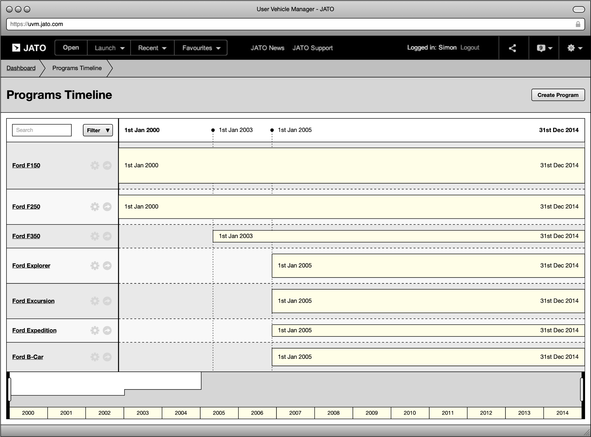
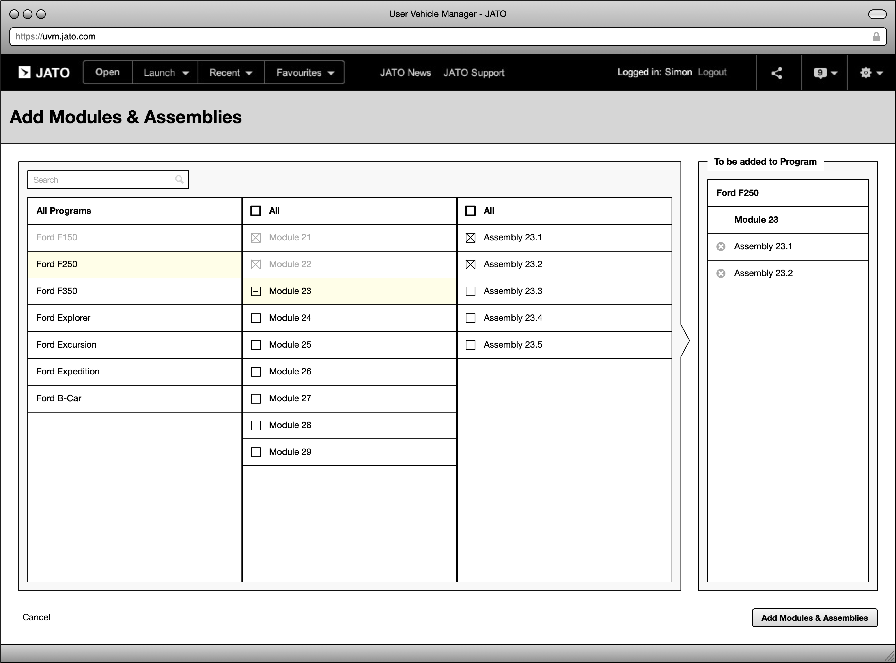
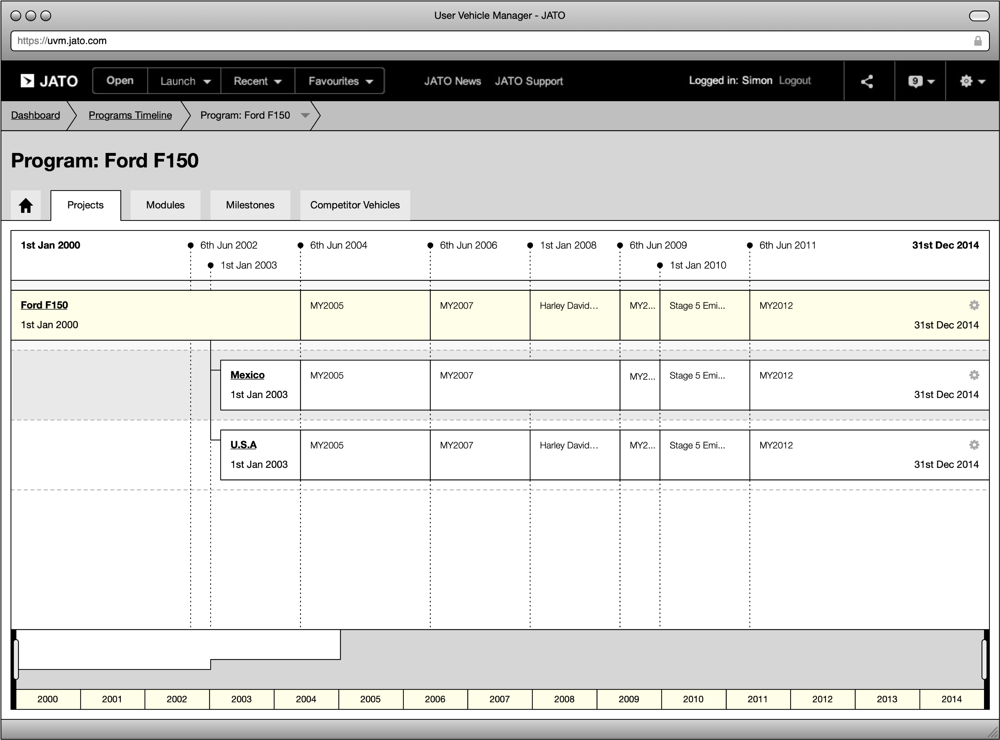
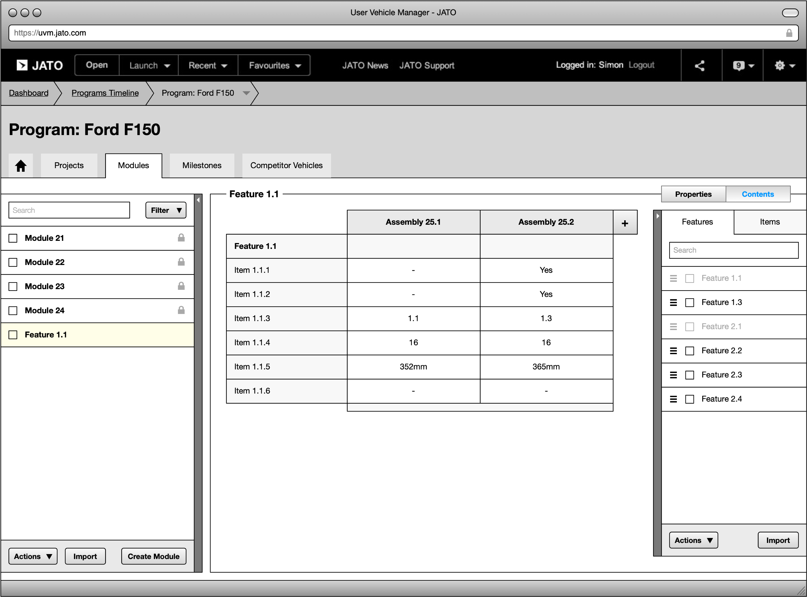

---

title: Reimagining the way the automotive industry design & produce new vehicles
summary: In 2013 I helped Jato design a tool that would change the way vehicle manufacturers design and develop new vehicles.

category: Project
client: Jato
tags: 
  - UX
  - Service design

---

Jato provide vehicle pricing data, specification comparisons and much more to many of the world’s leading vehicle manufacturers through their enterprise-scale software. In 2013 I helped Jato design a tool that would change the way vehicle manufacturers design and develop new vehicles.

- **I uncovered and shared insights on how the industry currently designs vehicles**. I worked with domain experts from Ford and Mazda to build an understanding of the processes they follow and systems they use.
- **I mapped user journeys, created conceptual diagrams and wrote personas**. I created artefacts to help me distill my findings and disseminate them throughout the wider project team.
- **I designed navigation systems, user interfaces and visualisations**, working closely with the development team to ensure our designs were feasible and capable of showing the vast amounts of data involved in the vehicle design process.
- **I designed models of key concepts**, testing how data at this scale could be used in a way that balanced user experience against performance.
- **I ran user tests using prototypes of key concepts**. I used real vehicle data and project timelines to test with domain experts, users and customers.

<figure>
  <ul>
    <li>
      <a href="images/post_1_1.png">
        <picture>
          
        </picture>
      </a>
    </li>
    <li>
      <a href="images/post_1_2.png">
        <picture>
          
        </picture>
      </a>
    </li>
    <li>
      <a href="images/post_1_3.png">
        <picture>
          
        </picture>
      </a>
    </li>
    <li>
      <a href="images/post_1_4.png">
        <picture>
          
        </picture>
      </a>
    </li>
  </ul>
  <figcaption>Wireframes showing the various navigation elements and data manipulation tools designed as part of the vehcile design appplication.</figcaption>
</figure>