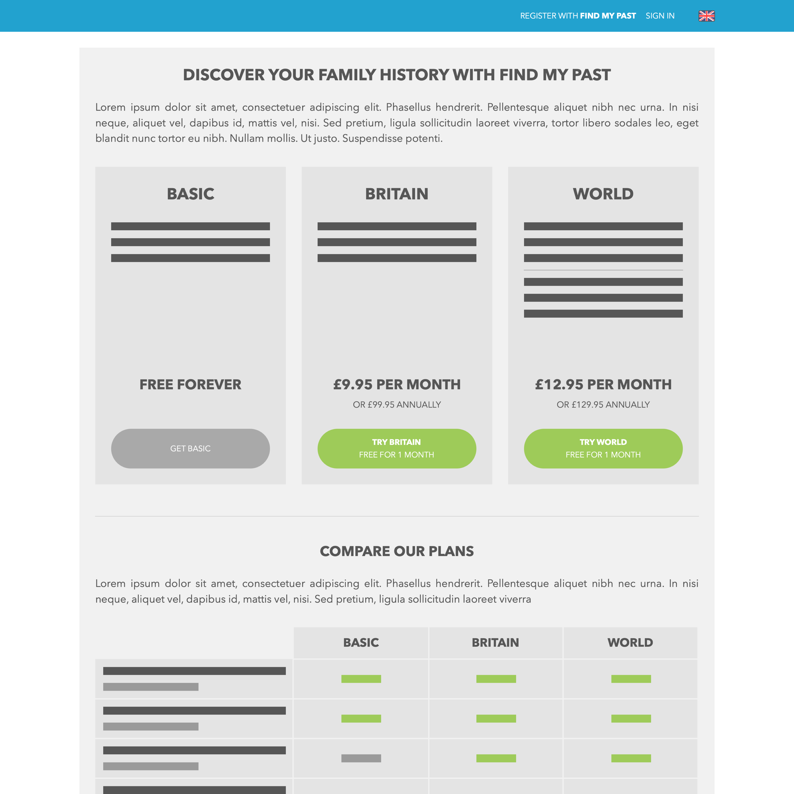
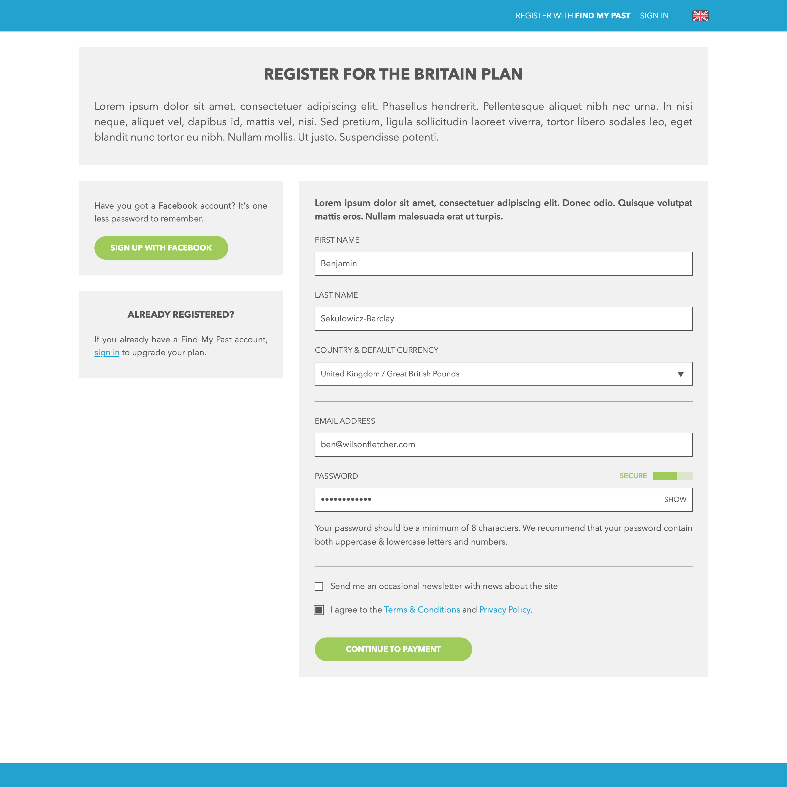
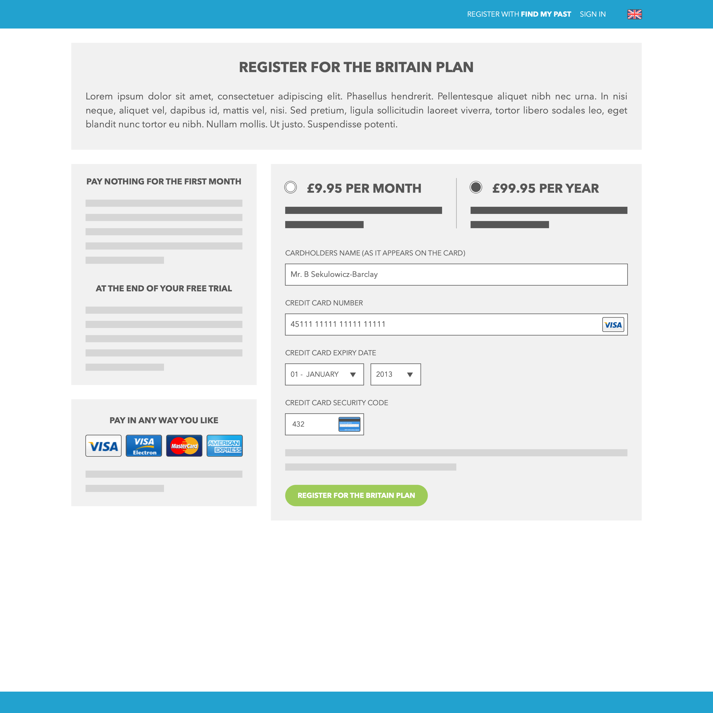
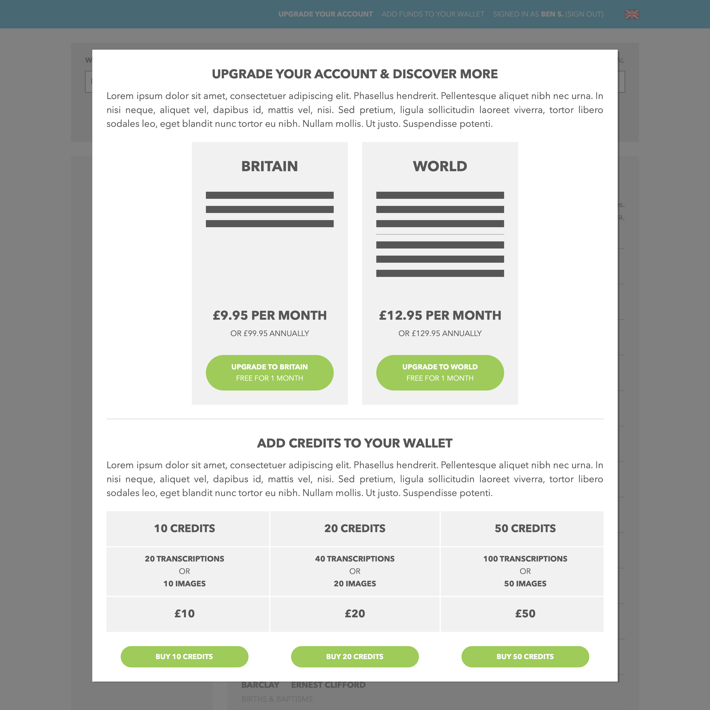

---

title:  Redesigning how people join & pay for a leading genealogy service
summary: In 2014 I helped Find my Past to redesign their membership model and payment journeys.

category: Project
client: Find my Past
tags: 
  - Service design

---

Find My Past were the first company in the world to put the complete birth, marriage, and death indexes for England and Wales online, and they now provide over 4 billion searchable records available. In 2014 I helped Find my Past to redesign their membership model and payment journeys.

- **I interviewed users and ran workshops** to learn how people derived value from the service and understand when and how they made the decision to sign up and spend money.
- **I created posters and presentations** for the board and senior management team, sharing our learning on how their customers wanted to use and pay for their service.
- **I mapped user journeys and created wireframes** outlining the key findings we had uncovered, working with their creative director and design team to incorporate them directly into their new visual language.

<figure>
  <ul>
    <li>
      <a href="images/post_1_1.png">
        <picture>
          
        </picture>
      </a>
    </li>
    <li>
      <a href="images/post_1_2.png">
        <picture>
          
        </picture>
      </a>
    </li>
    <li>
      <a href="images/post_1_3.png">
        <picture>
          
        </picture>
      </a>
    </li>
    <li>
      <a href="images/post_1_4.png">
        <picture>
          
        </picture>
      </a>
    </li>
  </ul>
  <figcaption>Wireframes showing the three-tiered membership system designed for Find my Past, with upgrade prompts placed throughout the user journeys and a streamlined registration and payment flow.</figcaption>
</figure>